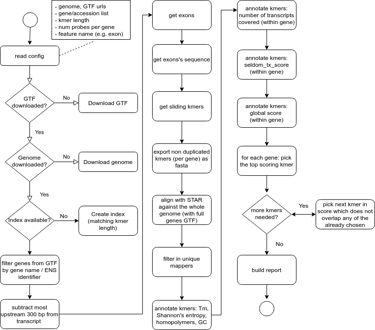

```{r}
suppressPackageStartupMessages({
    library(knitr)
    ## library('TmCalculator')
    ## library('msu')               # for Shannon's entropy (categorical)     
    library('data.table')
    ## library('Matrix')
    ## library('foreach')
    ## library('doParallel')
})
```

```{r}
opts_chunk$set(fig.width = 5,
               fig.height = 5,
               dev = 'png',
               cache = FALSE,
               include = TRUE,
               cache.lazy = FALSE,
               warning = TRUE,
               echo = TRUE,
               message = TRUE)
```

```{r}
WD <- '/home/imallona/giulia'
FILTERED_BED <- file.path(WD, 'safe_exons.bed')
KMER_LENGTH <- 25
NTHREADS <- 10
NUM_PROBES <- 3   ## probes per gene
OUTPUTS <- file.path(WD, 'probes')
FEATURES <- file.path('/home/imallona', 'src',
                      'ebrunner_spectral', '01_proof_of_concept', 'data', 'tf_mouse_gmoro.txt')
```

This PoC Spectral probe design runs on this gene list:

```{r}
print(FEATURES)
```

```{r}
fd <- list()
for (fn in list.files(OUTPUTS, pattern = "*tsv.gz")) {
    fd[[basename(fn)]] <- data.table::fread(file.path(OUTPUTS, fn), header = TRUE)
}

fd <- do.call(rbind.data.frame, fd)
```

TODO list

```
- Make sure the kmers don't overlap multiple genes (multifeature)
- Design a visualization approach
- Keep track of how many probes are filtered out at each step; document this within the report
- Parallelize (by gene) DONE by chromosome (?)
```

Design



```
Simplified algorithm for probe picking, based in continuous scoring:
- for each gene
-   for each probe
-     compute a compound score (to be refined)
-   sort by compound score
-   pick top probe
-   loop through the picking procedure
-      browse probes with decreasing scores to pick the best performing iff it does not overlap
         any previously picked ones; pick it, if satisfying the condition
-      repeat till the required num probes is fulfilled
```

The final score could be built on these individual scores (currently implemented):

```
- num transcripts covered
- GC content (boolean, being within a 'valid' range or not)
- Presence of homopolymers (4-mers) (boolean)
- Tm Wallace (not used for scoring yet)
- Tm SantaLucia (not used for scoring yet)
- `seldom_tx_score`: a measure of how 'unusual' the transcripts covered by a probe are.
```

Most of them are self-explanatory, except `seldom_tx_score`. This score is designed to favour probes which overlap to seldom/rare transcripts. Frequencies are defined from tabulating the pool of kmers for that gene: some transcripts have less kmers overlapping them, and we'd like to measure that.

To do so, `seldom_tx_score` sums the (decreasing) ranks of all transcripts scrutinized by the candidate probes, e.g. giving a `1` to the most represented one, a `2` to the next one, etc. 

The aim is to break any possible ties of probes covering the same (total) number of transcripts, favouring the low frequence transcripts (within the kmer pool). (The assumption is that other kmers for the same gene will pick the most common transcripts anyway.) (It is worth noting that the final compound score also weights the number of transcripts covered, so the `seldom_tx_score` is just one component of the global probe score.)

Example: random gene, with two transcripts only.

```
gene A transcripts:
      Var1 Freq rank
1 ENSMUST1  295    2
2 ENSMUST2  531    1
```

So probes can be scored depending on how many transcripts do they cover: if overlapping

```
probe A: overlaps both: will have a score of 1+2 = 3
probe B: overlaps ENSMUST1 only: 2 (reward; few probes overlap ENSMUST1)
probe C: overlaps ENSMUST2 only: 1 (penalty; there are many probes overlapping ENSMUST2)
rest of probes: will tend to overlap ENSMUST2 and not ENSMUST1
```

Another example: random gene, with three transcripts:

```
gene B transcripts:
                  Var1 Freq rank
1 ENSMUST1  795    1
2 ENSMUST2  531    2
3 ENSMUST3  100    3
```

And we're trying to score four probes:

```
probe      tx covered           seldom_tx_score
probe1     ENSMUST1             1
probe2     ENSMUST1,ENSMUST2    1+2=3
probe3     ENSMUST2,ENSMUST3    2+3=5
probe4     ENSMUST1,ENSMUST3    1+3=4
rest of probes .                .
```

So in this case, in the absence of any other reason to score the probes differently, we would pick:
probe3 > probe4 > probe2 > probe1 > (others).

If only one transcript present, all kmers are assigned `seldom_tx_score = 1`.

Compound scoring. The current score favours (linearly, unweighted): number of transcripts covered, (somewhat normalized) `seldom_tx_score`, Shannon entropy (a measure of probe complexity), having a GC content in a safe range (40 < x < 60 Celsius), lacking homopolymers (absence of 4-mers), and number of SNPs.

Document the normalized seldom tx score here.

```
TODO
```

```
(1)    fd[[gene_id]]$num_transcripts +
(2)    (fd[[gene_id]]$seldom_tx_score/recursive_sum(fd[[gene_id]]$num_transcripts))
(3)    fd[[gene_id]]$shannon_entropy +
(4)    as.numeric(fd[[gene_id]]$valid_gc) + 
(5)    (as.numeric(fd[[gene_id]]$homopolymer) * -1)
(6)    (fd[[gene_id]]$num_snps * -1)
```

Document the SNP procedure here

```
TODO
```

# PoC {.tabset .tabset-fade .tabset-pills}

Browsing 10 genes. 

```{r}
## gtf here

gtf <- read.table(FILTERED_BED)
colnames(gtf) <- c('gtf_chr', 'gtf_start', 'gtf_end', 'gtf_id', 'gtf_feature', 'gtf_strand')

gtf <- cbind(gtf,
           strcapture(
               pattern = "ID.*exon:(.*);Parent.*gene_id=(.*);.*transcript_id=(.*);gene_type.*",
               x = gtf$gtf_id,
               proto = list(exon = character(),
                            gene_id = character(), transcript_id = character())))


```

```{r, results = 'asis'}

known <- aggregate(gtf$transcript_id,
                   list(gene = gtf$gene_id,
                        transcript = gtf$transcript_id),
                   FUN = function(x) length(unique(x)))

fd <- as.data.frame(fd)
for (gene_id in head(unique(fd$gene_id), 10)){

    cat('## ', gene_id, '{.tabset .tabset-fade .tabset-pills} \n\n')
    
    cat('### Known transcripts \n\n')
    to_design <- known[known$gene == gene_id, ]
    print(knitr::kable(to_design, row.names = FALSE))
    cat('\n\n')
    
    cat('### Picked probes \n\n')

    designed <- fd[fd$gene_id == gene_id,]
    print(knitr::kable(designed, row.names = FALSE))

    cat('### Covered transcripts (percent) \n\n')

    to_design$covered <- to_design$transcript  %in%
        unlist(strsplit(designed$transcripts, split = ';'))

    print(sum(to_design$covered)/nrow(to_design) * 100)
    
    cat('\n\n')
}
    
```

# Overall stats

Genes provided (symbols)
```{r}
con <- file(FEATURES) 
(num_genes <- length(readLines(con))-1)
close(con)

```

Genes for which kmers were designed:

```{r}
print(length(unique(fd$gene_id)))
```

Ratio designed/intended:

```{r}
length(unique(fd$gene_id))/num_genes
```

Per gene: num transcripts in GTF *after* filtering out the 300 bp per transcript, num transcripts for which kmers were designed (coverable due to the 300 bp limit), number of transcripts covered by probes.

```{r}
known <- aggregate(gtf$transcript_id,
                   by=  list(gtf$gene_id),
                   FUN = function(x) length(unique(x)))

colnames(known) <- c('gene_id', 'num_tx')

## fd <- do.call(rbind.data.frame,
##                   lapply(fd, function(x) return(x[x$picked,])))


## to get the num transcripts covered per gene, we need to aggregate
## the unique transcripts per gene from the probes'data

covered <- with(fd, tapply(transcripts, list(gene_id),
                           FUN = function(x) length(unique(unlist(strsplit(x, split = ";"))))))

covered <- data.frame(gene_id = names(covered),
                      num_covered_tx = covered)
```

Categorizing genes into:

```
- missing, no probes designed
- covered, some transcripts covered, but not all of them
- perfect, all transcripts covered
```

```{r}
missing <- data.frame(gene_id = unique(gtf$gene_id)[!unique(gtf$gene_id) %in% unique(fd$gene_id)],
                      num_covered_tx = 0)

covered <- rbind(covered, missing)

```

```{r}

tmp <- merge(known, covered, by = 'gene_id')
stopifnot(all(tmp$num_tx >= tmp$num_covered_tx))
              
tmp <- tmp[order(tmp$num_tx),]


tmp$status <- ifelse(tmp$num_covered_tx > 0, 'covered', 'missed')
tmp$status[tmp$num_tx == tmp$num_covered_tx] <- 'perfect'

table(tmp$status)
```


```{r, fig.width = 7, fig.height = 7}
par(mfrow = c(2,2), pty = "s")
plot(x = 1:nrow(tmp),
     y = tmp$num_tx,
     pch = 3,
     ylim = c(0, max(tmp$num_tx)),
     xlab = 'gene (sorted by num transcripts)',
     ylab = 'num target transcripts per gene',
     col = 'black',
     cex = 0.6,
     main = 'true tx per gene')

plot(x = 1:nrow(tmp),
     y = tmp$num_covered_tx,
     ylim = c(0, max(tmp$num_covered_tx)),
     ylab = 'num covered transcripts per gene',
     xlab = 'gene (sorted by num transcripts)',
     col = as.numeric(as.factor(tmp$status)),
     pch = 19,
     cex = 0.6,
     type = 'p',
     main = 'covered tx per gene')

legend('topleft', legend = levels(as.factor(tmp$status)),
       col= 1: nlevels(as.factor(tmp$status)),
       pch = 19,
       cex = 1)

## points(x = 1:nrow(tmp),
##        y = tmp$num_transcripts,
##        col = 'blue',
##        pch = 6,
##        type = 'b')

plot(x = 1:nrow(tmp),
     y = tmp$num_tx,
     ylim = c(min(tmp$num_covered_tx - tmp$num_tx),
              max(tmp$num_tx)),
     pch = 3,
     cex = 0.6,
     xlab = 'gene (sorted by true num transcripts)',
     ylab = 'num transcripts',
     main = 'delta',
     col = 'black')

points(x = 1:nrow(tmp),
     y = tmp$num_covered_tx - tmp$num_tx,
     col = 'darkblue',
     pch = 19,
     cex = 0.6,
     type = 'p')

legend('topleft', legend = c("num target (true) tx",
                             "num covered tx - num true tx"),
       col=c("black", "darkblue"), pch = c(3, 19),
       cex = 1)

hist(tmp$num_covered_tx - tmp$num_tx,
     main = 'num covered tx -\n num true tx',
     breaks = 15)

```


```{r, fig.width = 6, fig.height = 6}
par(mfrow = c(1,1), pty = "s")

plot(y = jitter(tmp$num_covered_tx, 2),
     x = jitter(tmp$num_tx, 2),
     ylim = c(0, max(tmp$num_tx)),
     xlim = c(0, max(tmp$num_tx)),
     xlab = 'num target tx per gene (jitter)',
     ylab = 'num covered tx per gene (jitter)',
     col = 'black',
     pch = 19,
     cex = 0.4,
     main = "covered vs true transcripts\n(each point a gene)")

abline(a = 0, b = 1, col = 'blue')

fit <- lm(tmp$num_covered_tx ~ tmp$num_tx)
r2 <- summary(fit)$adj.r.squared
abline(fit, col = 'darkred')

coef_lm <- fit$coefficients

lm_eqn <- function(fit){

    eq <- sprintf('y = %s + %s * %s',
                  format(unname(coef(fit)[1]), digits = 2),
                  format(unname(coef(fit)[2]), digits = 2),
                  'x')
    as.character(as.expression(eq));
}

text(x = 4, y = 20, labels = lm_eqn(fit), col ='darkred', cex = 0.6)
text(2, 21, labels = sprintf('R^2=%s', round(r2, 2)), col = 'darkred', cex = 0.6)
```

# Session info

```{r}
devtools::session_info()
system('whoami')
system('uname -a')
```
