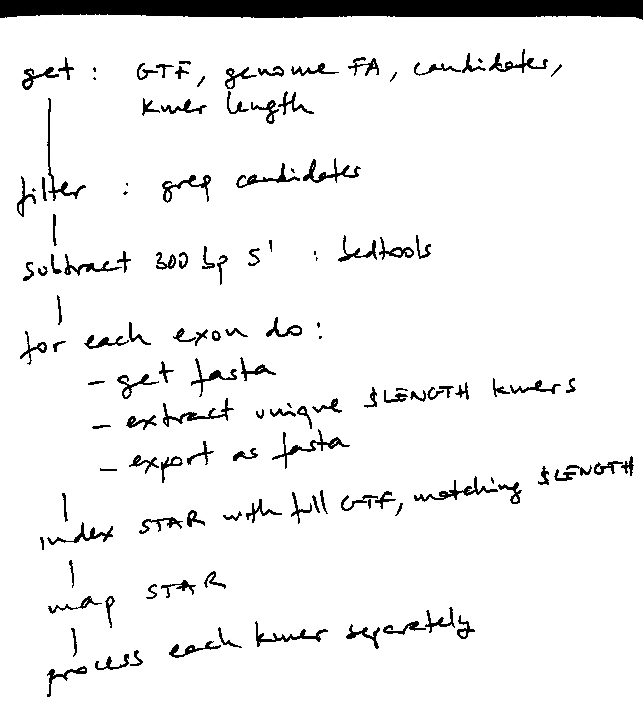
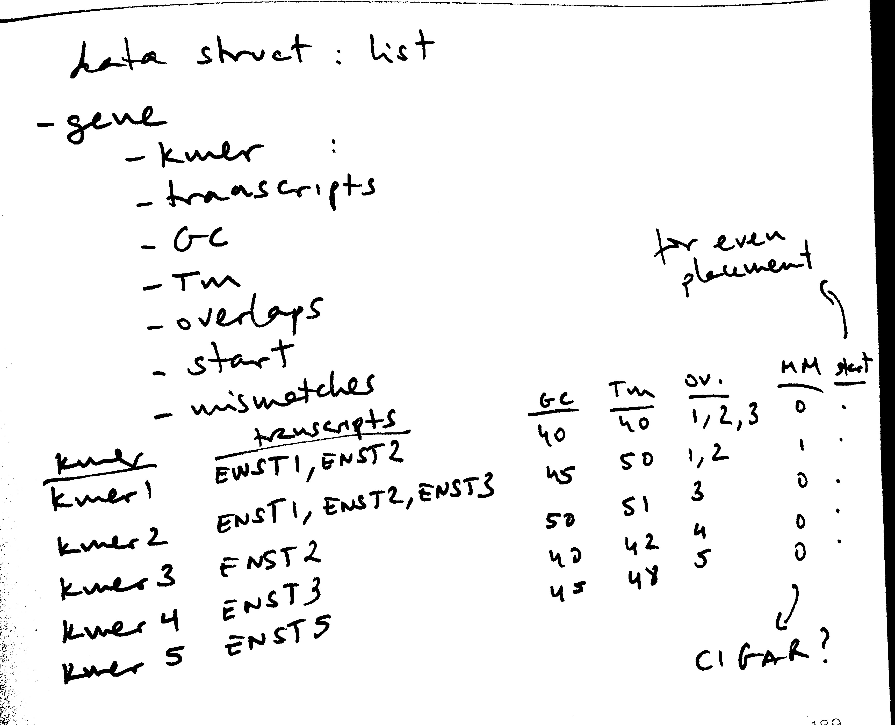

```{r}
suppressPackageStartupMessages({
    library(knitr)
    library('TmCalculator')
    ## library('entropy')
    ## library('rDNAse')
    library('msu')             # for Shannon's entropy
    library('data.table')
    library('Matrix')
})
```

```{r}
opts_chunk$set(fig.width = 5,
               fig.height = 5,
               dev = 'png',
               cache = FALSE,
               include = TRUE,
               cache.lazy = FALSE,
               warning = TRUE,
               echo = TRUE,
               message = TRUE)
```

```{r}
WD <- '/home/imallona/giulia'
KMER_LENGTH <- 25
NTHREADS <- 10
NUM_PROBES <- 3   ## probes per gene
MAPPING <- file.path(WD, 'mapping', sprintf('kmers_%s.uniques.gz', KMER_LENGTH))
FILTERED_BED <- file.path(WD, 'safe_exons.bed')
FEATURES <- file.path('/home/imallona', 'src',
                      'ebrunner', '01_proof_of_concept', 'data', 'tf_mouse_gmoro.txt')
DOWNSAMPLE <- TRUE

```

```{r}

## TODO test properly, for 0/1 starts etc
overlaps <- function(a_chr, a_start, a_end,
                     b_chr, b_start, b_end) {
    res <- FALSE
    if (a_chr != b_chr){
        res <- FALSE
    }
    else {
        if (a_start %in% b_start:b_end | a_end %in% b_start:b_end |
            b_start %in% a_start:a_end | b_end %in% a_start:a_end) {
            res <- TRUE
        }
    }

    return(res)
}

## overlaps(a_chr = 'a',
##          a_start = 1,
##          a_end = 10,
##          b_chr = 'a',
##          b_start = 2,
##          b_end = 5)

## overlaps(a_chr = 'a',
##          a_start = 1,
##          a_end = 10,
##          b_chr = 'a',
##          b_start = 1,
##          b_end = 1)

## overlaps(a_chr = 'a',
##          a_start = 20,
##          a_end = 30,
##          b_chr = 'a',
##          b_start = 1,
##          b_end = 10)

## TODO define the range that is 'valid' for this technique
valid_gc <- function(x){
    (x >= 40 & x < 60)
}

## this is not used... yet
valid_melting <- function(x) {
    (x > 45 & x < 60)
}
  
```

TODO list

```
- Make sure the kmers don't overlap multiple genes (multifeature)
- Design a visualization approach
- Keep track of how many probes are filtered out at each step; document this within the report
- Parallelize (by gene)
```

Shell design



Rmarkdown design



```{r}
d <- as.data.frame(data.table::fread(MAPPING, nrows = ifelse(DOWNSAMPLE, yes = 5e5, no = Inf)))
colnames(d) <- c('read', 'chr', 'start', 'match', 'NH', 'HI', 'NM', 'MD', 'AS', 'nM', 'kmer')

for (item in setdiff(colnames(d), c('read', 'chr', 'start', 'match', 'kmer'))){
    d[,item] <- as.numeric(gsub(paste0(item, ':i:|MD:Z:'), '', d[,item]))
}

```

```{r}
d <- cbind(d,
           strcapture(
               pattern = "exon_coord=(.*):([0-9]+)-([0-9]+)([-+]{1});(.*)_kmer.*",
               x = d$read,
               proto = list(sim_chr = character(),
                            sim_start = numeric(),
                            sim_end = numeric(),
                            sim_strand = character(),
                            exon = character())))
```

First consistency check, are the mapped reads mapping into a region matching the one was simulated? For that we check the chromosome matches, and the mapping site is at less than 1 Mbp from the simulated site.

```{r}
d$simulation_locus_match <- FALSE
d$simulation_locus_match <- d$sim_chr == d$chr & (abs(d$start - d$sim_start) < 1e6)
stopifnot(all(d$simulation_locus_match))
print('Check passed')

```


```{r}
## Then, annotate with the gene, transcript and exon names/coordinates,
## to check for even spacing, and feature covering.

gtf <- read.table(FILTERED_BED)
colnames(gtf) <- c('gtf_chr', 'gtf_start', 'gtf_end', 'gtf_id', 'gtf_feature', 'gtf_strand')

gtf <- cbind(gtf,
           strcapture(
               pattern = "ID.*exon:(.*);Parent.*gene_id=(.*);.*transcript_id=(.*);gene_type.*",
               x = gtf$gtf_id,
               proto = list(exon = character(),
                            gene_id = character(), transcript_id = character())))
```

```{r}

## Is this merge reasonable?
##                   why not bedtools intersect with the whole GTF, to have the CDS metadata too? 
d <- merge(d, gtf, by.x = 'exon', by.y = 'exon', all.x = TRUE)
d <- d[,setdiff(colnames(d), c('gtf_id', 'read'))]
```


```{r, eval = TRUE}

## we assume they share the chromosome, so we take into account just the start
d <- d[order(d$gene_id, d$start),]
fd <- list()

for (gene_id in unique(d$gene_id)) {
    curr <- d[d$gene_id == gene_id,]
    fd[[gene_id]] <- list()
    ## overlaps <- FALSE
    for (kmer in unique(curr$kmer)) {
        num_transcripts <- length(curr[curr$kmer == kmer, 'transcript_id'])
        transcripts <- paste(curr[curr$kmer == kmer, 'transcript_id'], collapse = ';')
        exons <- paste(curr[curr$kmer == kmer, 'exon'], collapse = ';')
        cigars <- paste(curr[curr$kmer == kmer, 'match'], collapse = ';')
        strand <- curr[curr$kmer == kmer, 'gtf_strand'][1]
        chr <- curr[curr$kmer == kmer, 'chr'][1]
        start <- curr[curr$kmer == kmer, 'start'][1]
        
        ## todo get the 1-offset right
        end <- ifelse(strand == '+',
                      yes = start + KMER_LENGTH,
                      no = start - KMER_LENGTH)

        ## overlaps <- abs(curr$start - fd[[gene_id]][[i]]) <---- how to do this efficiently
        fd[[gene_id]][[kmer]] <- setNames(c(gene_id, kmer, num_transcripts, transcripts, exons,
                                             cigars, chr, start, end),
                                          c('gene_id', 'kmer', 'num_transcripts', 'transcripts',
                                            'exons',
                                            'cigars', 'chr', 'start', 'end'))
    }
    ## cat('.')
}

```


```
simplified algorithm, based in continuous scoring:
- for each gene
-   for each probe
-     compute a compound score
-   sort by compound score
-   pick top probe
-   browse probes with decreasing scores to pick the best performing iff it does not overlap
       any previously picked one; pick it, if satisfying the condition
-   repeat till the required num probes is fulfilled
```

```{r}
  
for (gene_id in names(fd)) {
    ## cand-idates
    cand <- do.call(rbind.data.frame, fd[[gene_id]])
    colnames(cand) <- c('gene_id', 'kmer', 'num_transcripts', 'transcripts', 'exons',
                        'cigars', 'chr', 'start', 'end')
    nums <- c('num_transcripts', 'start', 'end')
    cand[,nums] <- lapply(cand[,nums], function(x) as.numeric(x))

    ## sequence complexity, Shannon's entropy on sliding 2-mers
    ## length of the substring
    k <- 2
    cand$shannon_entropy <- sapply(cand$kmer,
                                   function(x) msu::shannon_entropy(factor(substring(x, 1:(nchar(x)-k+1), k:nchar(x)))))

    cand$gc <- sapply(cand$kmer, function(x) TmCalculator::GC(x))
    cand$valid_gc <- valid_gc(cand$gc)
    
    regex <- '(A){4,}|(T){4,}|(C){4,}|(G){4,}'
    cand$homopolymer <- grepl(regex, cand$kmer, ignore.case = TRUE)

    ## filter only with a good GC content and without homopolymers
    cand <- cand[cand$valid_gc & !cand$homopolymer,]    

    ## cand <- cand[order(cand$num_transcripts, cand$shannon_entropy, decreasing = TRUE),]

    fd[[gene_id]] <- cand
    ## cat('.')
}
```

Scores used:

```
- num transcripts covered
- GC content
- Presence of homopolymers (4-mers)
- Tm Wallace (not used for scoring yet)
- Tm SantaLucia (not used for scoring yet)
- `seldom_tx_score`: a measure of how 'unusual' the transcripts covered by a probe are.
```

In detail, `seldom_tx_score` sums the (decreasing) ranks of all transcripts scrutinized by the candidate probes, e.g. giving a `1` to the least represented one, a `2` to the next one, etc. 

The aim is to break any possible ties of probes covering the same (total) number of transcripts, favouring the less frequent transcripts. (The assumption is that other probes for the same gene will pick the most common transcripts anyway).

Example: random gene, with two transcripts only.

```
gene A population:
                  Var1 Freq rank
1 ENSMUST00000108150.2  295    2
2 ENSMUST00000108151.3  531    1
```

So probes can be scored depending on how many transcripts do they cover: if overlapping

```
both: will have a score of 1+2 = 3
first one only: 2
second one only: 1 (so it's penalized because it covers the least kmer-covered transcript)
```

If only one transcript present, all kmers are given `seldom_tx_score = 1`.

```{r}
for (gene_id in names(fd)) {
    fd[[gene_id]]$seldom_tx_score <- 1
    
    ft <- as.data.frame(table(unlist(strsplit(fd[[gene_id]]$transcripts,
                                              split = ';'))))
    rownames(ft) <- ft$Var1
    
    if (nrow(ft) > 1) {
        ## rank, decreasing
        ft$rank <- rank(ft$Freq)
        for (i in 1:nrow(fd[[gene_id]])) {
            checked <- unlist(strsplit(fd[[gene_id]]$transcripts[i], split = ';'))
            fd[[gene_id]]$seldom_tx_score[i] <- sum(ft[checked,'rank'])
        }
    }
}

```

Get an aggregated score, sort by score, pick the top one and then browse the list downwards picking probes that don't overlap any of the above, till the required num probes per gene is full.filled

Current score favours (linearly) number of transcripts covered, seldom_tx_score, Shannon entropy, having a GC content inr ange, and lacking homopolymers (please note homopolymers are currently filtered out in a previous step - irrelevant here).

```
(1)    fd[[gene_id]]$num_transcripts +
(2)    fd[[gene_id]]$seldom_tx_score +
(3)    fd[[gene_id]]$shannon_entropy +
(4)    as.numeric(fd[[gene_id]]$valid_gc) + 
(5)    (as.numeric(fd[[gene_id]]$homopolymer) * -1)
```

```{r}
for (gene_id in names(fd)) {
    fd[[gene_id]]$picked <- FALSE
    fd[[gene_id]]$Tm_NN <- NA
    fd[[gene_id]]$Tm_Wallace <- NA
    
    fd[[gene_id]]$score <- fd[[gene_id]]$num_transcripts +
        fd[[gene_id]]$seldom_tx_score +
        fd[[gene_id]]$shannon_entropy +
        as.numeric(fd[[gene_id]]$valid_gc) +        
        (as.numeric(fd[[gene_id]]$homopolymer) * -1)

    fd[[gene_id]] <- fd[[gene_id]][order(fd[[gene_id]]$score, decreasing = TRUE),]

    fd[[gene_id]]$picked[1] <- TRUE

    picked <- fd[[gene_id]][1,]
    for (i in 2:nrow(fd[[gene_id]])) {        
        curr <- fd[[gene_id]][i,]


        if (!any(apply(picked, 1, function(x) overlaps(a_chr = curr$chr,
                 a_start = curr$start,
                 a_end = curr$end,
                 b_chr = x['chr'],
                 b_start = x['start'],
                 b_end = x['end']))))  {
            picked <- rbind(picked, curr)
            fd[[gene_id]]$picked[i] <- TRUE

            
        }

        if (sum(fd[[gene_id]]$picked) >= NUM_PROBES) break
    }

    ## add also some Tm data here, instead of at the scoring phase
    fd[[gene_id]]$Tm_NN <- sapply(fd[[gene_id]]$kmer,
                                      function(x) TmCalculator::Tm_NN(x,
                                                      ambiguous = FALSE, comSeq = NULL,
                                                      shift = 0,
                                                      nn_table = "DNA_NN4",
                                                      tmm_table = "DNA_TMM1",
                                                      imm_table = "DNA_IMM1",
                                                      de_table = "DNA_DE1",
                                                      dnac1 = 25,
                                                      dnac2 = 25,
                                                      selfcomp = FALSE,
                                                      Na = 50, K = 0, Tris = 0, Mg = 0,
                                                      dNTPs = 0, saltcorr = 5))

    fd[[gene_id]]$Tm_Wallace <- sapply(fd[[gene_id]]$kmer,
                                           function(x) TmCalculator::Tm_Wallace(x))
    
    ## cat('.')
}
```

# PoC {.tabset .tabset-fade .tabset-pills}

Browsing 10 genes. 

```{r, results = 'asis'}

known <- aggregate(gtf$transcript_id,
                   list(gene = gtf$gene_id,
                        transcript = gtf$transcript_id),
                   FUN = function(x) length(unique(x)))


for (gene_id in head(names(fd), 10)){

    cat('## ', gene_id, '{.tabset .tabset-fade .tabset-pills} \n\n')
    
    cat('### Known transcripts \n\n')
    to_design <- known[known$gene == gene_id, ]
    print(knitr::kable(to_design, row.names = FALSE))
    cat('\n\n')
    
    cat('### Picked probes \n\n')

    designed <- fd[[gene_id]][fd[[gene_id]]$picked,]
    print(knitr::kable(designed, row.names = FALSE))

    cat('### Covered transcripts (percent) \n\n')

    to_design$covered <- to_design$transcript  %in%
        unlist(strsplit(designed$transcripts, split = ';'))

    print(sum(to_design$covered)/nrow(to_design) * 100)
    
    cat('\n\n')
}
    
```

# Overal stats

Genes provided:

```{r}
con <- file(FEATURES) 
(num_genes <- length(readLines(con)))
close(con)

```

Genes for which kmers were designed:

```{r}
print(length(unique(d$gene_id)))
```

Per gene: num transcripts in GTF, num transcripts for which kmers were designed (coverable due to the 300 bp limit), number of transcripts covered by probes.

Add total number of transcripts (real, from GTF?)

```{r}
known <- aggregate(gtf$transcript_id,
                   by=  list(gtf$gene_id),
                   FUN = function(x) length(unique(x)))

colnames(known) <- c('gene_id', 'num_coverable_transcripts')

fd <- do.call(rbind.data.frame,
                  lapply(fd, function(x) return(x[x$picked,])))

tmp <- merge(fd, known, by = 'gene_id', all.x = TRUE)

tmp <- tmp[order(tmp$num_coverable_transcripts),]

```

```{r fig.width = 8, fig.height = 8}
plot(x = 1:nrow(tmp),
     y = tmp$num_coverable_transcripts,
     pch = 19,
     xlab = 'gene (sorted by num transcripts)',
     col = 'black')

points(x = 1:nrow(tmp),
       y = tmp$num_transcripts,
       col = 'darkred',
       pch = 3,
       type = 'b')

## points(x = 1:nrow(tmp),
##        y = tmp$num_transcripts,
##        col = 'blue',
##        pch = 6,
##        type = 'b')

```

Average number probes per gene... it's three for all of them (?).

```{r}
summary(aggregate(tmp$kmer,
                  by=  list(tmp$gene_id),
                  FUN = function(x) length(x)))

```

# Exports

```{r}
saveRDS(file = 'fd.rds', fd)
```

# Session info

```{r}
devtools::session_info()
system('whoami')
system('uname -a')
```
